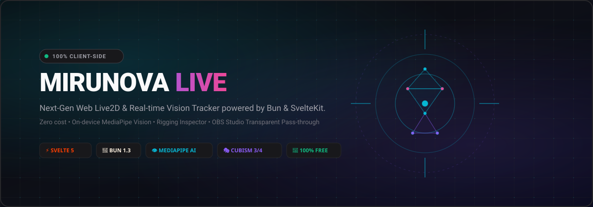

<div align="center">



# MiruNova Live (見るNova)
**Next-Generation, Zero-Cost, In-Browser Live2D & 3D Real-Time Vision Tracker**

[](https://bun.sh)
[](https://svelte.dev)
[](https://svelte.dev)
[](https://developers.google.com/mediapipe)
[](https://www.live2d.com)
[](https://threejs.org)
[](LICENSE)
[](#zero-cost--privacy-mandate)

*Tags: `#live2d` `#vtuber` `#face-tracking` `#hand-tracking` `#mediapipe` `#threejs` `#svelte5` `#bun` `#pixijs` `#webgl` `#zero-cost` `#obs-studio`*

</div>

---

## 🌟 Overview

**MiruNova Live** is an ultra-lightweight, 100% client-side web application for real-time Live2D & 3D avatar animation and vision tracking. Powered by **Bun**, **SvelteKit 5 (Runes)**, **Google MediaPipe Vision**, and **Pixi.js / Three.js**, it brings professional VTuber studio capabilities straight to your browser without heavyweight native installations, watermark restrictions, or paid cloud APIs.

---

## ✨ Features

### 👁️ 1. Full-Body, Face & Hand Recognition
* **Head Pose Kinematics:** 3-axis Euler angle tracking (Yaw, Pitch, Roll) with raw posture baseline calibration.
* **Eye & Gaze Tracking:** Independent eye blink (`ParamEyeLOpen`, `ParamEyeROpen`), anti-jitter blink threshold, synchronized blink toggle, and iris gaze deflection (`ParamEyeBallX`, `ParamEyeBallY`).
* **Eyebrows & Expressions:** Brow elevation/furrowing (`ParamBrowLY`, `ParamBrowRY`), cheek puff (`ParamCheek`), smile/frown curve (`ParamMouthForm`), and sadness/frown recognition.
* **Lip-Sync & Phonemes:** Real-time jaw displacement (`ParamMouthOpenY`) and mouth skew (`ParamMouthX`) mirroring your spoken speech.
* **Hand Tracking & Gestures:** 21-keypoint MediaPipe hand landmark detection mapping arm angles (`ParamArmLA/RA`) and high-five gesture detection.

### 💾 2. Persistent Configuration Storage
* **Automatic LocalStorage Sync:** Model choice, 3D avatar, UI theme, background style, hex color, sensitivity, smoothing, deadzone, hand tracking, pose loops, and calibration offsets automatically persist across browser refreshes.
* **Backup & Restore (JSON):** Export your entire studio configuration to a `.json` backup file and import it anytime.
* **Factory Reset:** One-click reset to restore default factory preferences.

### 📊 3. Hardware Benchmark & Spec Tier
* **GPU & CPU Detection:** Automatically identifies GPU renderer via WebGL (`WEBGL_debug_renderer_info`) and CPU thread concurrency.
* **Performance Rating Bar:** Calculates a dynamic 0–100 benchmark score displayed on a Red-to-Green gradient progress bar:
  * 🔴 **Tidak Lancar (< 35):** Software rendering / low-spec integrated GPU advice.
  * 🟡 **Cukup (35 – 59):** 30–45 FPS performance suitable for 720p streams.
  * 🟢 **Lancar (60 – 84):** Solid 60 FPS performance for 1080p stream capture.
  * 🌟 **Sangat Lancar / Ultra (85 – 100):** Dedicated GPU hardware acceleration.
* **Factual Hardware Reporting:** Explains browser WebGL rasterization versus CPU SIMD MediaPipe pipeline, with actionable instructions on routing browser processes to high-performance dedicated GPUs (NVIDIA/AMD) in Windows Settings.

### 🛠️ 4. Foldable Accordion Rigging Inspector & Windowed Mode
* **Categorized Accordion Cards:** Organized into 7 collapsible categories:
  * 👤 **Head Kinematics** (Angle X, Y, Z, Invert Pitch/Yaw)
  * 👁️ **Eyes & Eyebrows** (Open, Smile, Form, Gaze, Anti-Jitter)
  * 👄 **Mouth & Phonemes** (Open Y, Form, Skew X)
  * 🫀 **Body & Breathing** (Angle X, Y, Z, Breath)
  * ✋ **Hands & High-Five** (Hand Angles L & R)
  * 📐 **Framing & Parts** (Full Body, Bust-Up, Close-Up, Individual Part Visibility & Opacity, Square Frame with Edge Fade)
  * 📁 **Discovered Parameters** (Dynamic Live2D Core Parameters)
* **Docked & Windowed Layouts:** Toggle between docked "Stay" right-rail mode or freely draggable, resizable windowed floating mode.

### 🎯 5. Accurate Calibration & Invert Controls
* **Raw Posture Baseline:** Captures raw uncalibrated webcam posture (`lastRawYaw`, `lastRawPitch`, `lastRawRoll`) and zeros the current head rotation.
* **Invert Pitch & Yaw:** Easily invert vertical look pitch (fixes inverted look up/down) and horizontal yaw.
* **Quick Tracking Presets:** Instant calibration for Responsive (low-end 30fps webcams), Balanced (default), and Ultra Smooth (cinematic).

### 📸 6. Screenshot & Instant Download
* **One-Click Capture:** Click the Camera icon on the Control Dock to immediately capture the avatar canvas.
* **Transparent PNG Support:** Retains alpha channel transparency for thumbnail creation, Discord emotes, and streaming assets.
* **Dual Engine Support:** Works seamlessly across both Live2D Cubism and Three.js 3D stages.

### 🎙️ 7. Web Audio DSP Engine & AI Voice Conversion Guide
* **Real Browser Web Audio API:** Native microphone input device selector, volume gain slider, and real-time VU meter with local DSP voice filters (Natural, Anime Treble, Radio Broadcaster, Walkie-Talkie, Warm Podcast).
* **Neural AI Voice Conversion (W-Okada RVC + VB-Cable):** Step-by-step setup guide for running W-Okada Realtime AI Voice Changer with local CUDA acceleration routed via VB-Cable virtual audio cable.

### 🎨 8. Theme & Background Studio
* **Background Modes:** Transparent (OBS ready), Cyber Mesh (square grid), Solid Color, Tech Grid, Polka Dots, Cosmic Animated (drifting nebula), Deep Gradient, Chroma Green/Blue (#00FF00 / #0000FF), and Custom Photo Upload.
* **Square Frame with Organic Fade:** Streamer-ready 1:1 square frame box with smooth organic edge fading gradient mask.
* **UI Themes:** Cyber Dark, Midnight Navy, Synthwave Sunset, and Minimal Monochrome with reactive autosave to `localStorage`.

### 🎭 9. Multi-Engine Model Catalog
* **2D Live2D Models:** Mihari (`Mihari_V1`), Vivian (`薇薇安`), Haru Greeter, Hiyori Momose, Mao, Shizuku, Wanko & Rice, and custom `.model3.json` local file loader.
* **3D Avatar Engine (Three.js):** Procedural rigged anime cats (Mochi, Kuro, Tora) with reactive ears, head rotation, eye blinks, paw gestures, and tail sway + custom `.glb` upload.

### 🎥 10. OBS Studio Integration
* **One-Click Screen Mode:** Hides all application UI leaving only the avatar stage.
* **Auto-Fading Control Pill:** Streamer controls fade out after 3 seconds of cursor inactivity.
* **URL Parameter Integration:** Add `?obs=true&bg=transparent` or `?obs=true&bg=chroma` directly to OBS Browser Source for zero-configuration integration.

---

## 🚀 Quickstart

### Prerequisites
* [Bun](https://bun.sh) (v1.2+ or v1.3+) installed.
* Modern Web Browser with WebGL support (Google Chrome, Microsoft Edge, Brave).
* Standard webcam (720p 30fps recommended).

### Installation & Run

```bash
# Clone the repository
git clone https://github.com/your-username/mirunova-live.git
cd mirunova-live

# Install dependencies with Bun
bun install

# Start development server
bun run dev --open
```

Open **`http://localhost:5173/`** in your browser.

> ⚠️ **Note on Webcam Permissions:** Browsers enforce webcam access only on **Secure Contexts** (`http://localhost` or `https://`). If accessing over your local network IP (e.g. `http://192.168.x.x`), camera access will be blocked by default browser security policies.

---

## ⌨️ Streamer Hotkeys

| Hotkey | Action | Description |
| :--- | :--- | :--- |
| **`H`** | Toggle Menu Dock | Sembunyikan / Tampilkan panel dock bawah |
| **`Space`** | Toggle Webcam Tracking | Mulai atau hentikan vision tracking webcam |
| **`C`** | Calibrate Head Pose | Reset head yaw, pitch, and roll to neutral center |
| **`M`** | Open Models Catalog | Buka katalog avatar 2D Live2D & 3D Cats |
| **`T`** | Open Themes & Backgrounds | Buka menu kustomisasi tema, grid mesh & latar |
| **`R`** | Toggle Rigging Panel | Buka / tutup drawer inspeksi parameter rigging |
| **`S`** | Screenshot Avatar | Tangkap avatar langsung dan unduh file PNG |
| **`O`** | Toggle OBS Screen Mode | Switch between studio controls and clean streamer view |
| **`,` / `F2`** | Open Settings | Buka menu spesifikasi sistem & benchmark |
| **`?` / `F1`** | Shortcut Guide Cheatsheet | Tampilkan panduan lengkap seluruh tombol shortcut |
| **`P`** | Toggle PIP Camera | Sembunyikan / tampilkan preview webcam PIP |
| **`B`** | Toggle Eye Blink Sync | Sinkronisasi kedipan mata kiri dan kanan |
| **`1` – `4`** | Switch UI Themes | Ganti tema cepat (Cyber, Midnight, Synth, Mono) |
| **`Escape`** | Close Modals / Exit OBS | Dismiss open modals, drawers, or exit OBS view |

---

## 🧪 Testing

MiruNova Live includes native unit tests utilizing Bun's built-in test runner (`bun:test`):

```bash
# Run all unit tests
bun test

# Run tests in watch mode
bun test --watch

# Verify TypeScript and Svelte diagnostics
bun run check

# Production build test
bun run build
```

---

## 🏗️ Architecture

```
[Webcam Stream]
       │
       ▼
[MediaPipe Vision (WASM / WebGL)] ──► 478 Face Mesh & 21 Hand Landmarks
       │
       ▼
[Mathematical Rigging Solver]     ──► Yaw/Pitch/Roll, Eyes, Mouth, Hands, Gestures
       │
       ▼
[Lerp Smoother & Deadzone Filter] ──► Jitter & Drift Elimination
       │
       ▼
[Rigging Multiplexer]             ◄── Manual Accordion Sliders Override
       │
       ▼
┌─────────────────────────────────┴─────────────────────────────────┐
│                                                                   │
▼                                                                   ▼
[Pixi.js v7 Cubism Canvas]                              [Three.js 3D WebGL Canvas]
(Live2D Models & Reactive 2D)                          (3D Cats & Custom GLB Files)
```

---

## 🔒 Zero-Cost & Privacy Mandate

* **100% Free & Open Source:** Zero subscription fees, zero watermark charges, zero cloud API tokens.
* **Local On-Device Execution:** All computer vision calculations execute entirely in your client browser via WebAssembly. No video frames or biometric data ever leave your computer.

---

## 📜 License

This project is licensed under the **MIT License**. Live2D sample models and Cubism Core runtime are copyright of Live2D Inc. and used under non-commercial developer evaluation terms.
