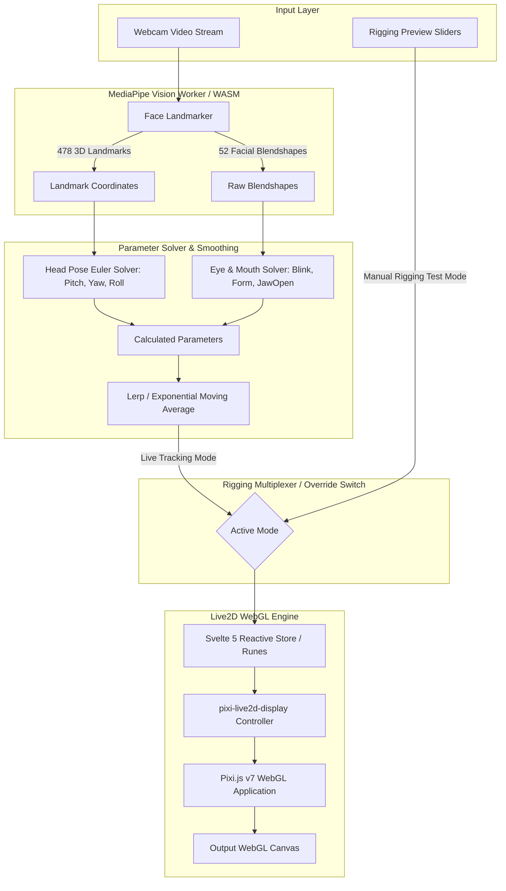

# 03. Architecture — MiruNova Live

## 1. System Overview & Data Flow Pipeline



---

## 2. Core Modules Architecture

### 2.1 Camera & MediaPipe Face Landmarker (`src/lib/core/tracker.ts`)
* Inisialisasi `@mediapipe/tasks-vision` menggunakan `FilesetResolver.forVisionTasks()`.
* Model file `face_landmarker.task` diakses melalui CDN gratis atau aset statis lokal.
* Menghasilkan:
  * `facialTransformationMatrixes`: Matriks rotasi 4x4 untuk kalkulasi orientasi kepala (Yaw, Pitch, Roll).
  * `faceBlendshapes`: 52 nilai blendshape Apple ARKit-compatible (0.0 s/d 1.0) seperti `eyeBlinkLeft`, `eyeBlinkRight`, `jawOpen`, `mouthSmileLeft`, dll.

### 2.2 Mathematical Solver & Normalizer (`src/lib/core/solver.ts`)
Mengonversi matriks dan blendshapes menjadi parameter standar Live2D Cubism:
* **Head Angle X (Yaw):**
  $$\text{ParamAngleX} = \text{clamp}(\text{yaw} \times \text{sensitivity}_X, -30, 30)$$
* **Head Angle Y (Pitch):**
  $$\text{ParamAngleY} = \text{clamp}(\text{pitch} \times \text{sensitivity}_Y, -30, 30)$$
* **Head Angle Z (Roll):**
  $$\text{ParamAngleZ} = \text{clamp}(\text{roll} \times \text{sensitivity}_Z, -30, 30)$$
* **Eye Blink:**
  $$\text{ParamEyeLOpen} = 1.0 - \text{blendshapes}['eyeBlinkLeft']$$
  $$\text{ParamEyeROpen} = 1.0 - \text{blendshapes}['eyeBlinkRight']$$
* **Mouth Open:**
  $$\text{ParamMouthOpenY} = \text{blendshapes}['jawOpen']$$

### 2.3 Parameter Smoother / Damping (`src/lib/core/smoother.ts`)
Untuk mencegah getaran (*micro-jitter*) dari sensor kamera, digunakan linear interpolation:
$$P_{t} = P_{t-1} + (P_{target} - P_{t-1}) \times \alpha$$
Nilai default $\alpha = 0.35$ (dapat diatur di settings).

### 2.4 Rigging Preview & Override Multiplexer (`src/lib/stores/riggingStore.svelte.ts`)
* Menyimpan daftar seluruh parameter yang didukung oleh model yang sedang dimuat via `model.internalModel.coreModel._parameterIds`.
* Menyediakan state:
  * `isManualTestMode: boolean`
  * `liveParams: Record<string, number>` (nilai aktual dari tracking)
  * `overrideParams: Record<string, number>` (nilai yang diinputkan pengguna via slider)
* Saat `isManualTestMode == true`, loop render mengambil nilai dari `overrideParams`, memungkinkan rigger menguji deformasi mesh secara presisi tanpa webcam.

### 2.5 Live2D Stage Renderer (`src/lib/components/CanvasStage.svelte`)
* Menggunakan `pixi.js` Application dengan `backgroundAlpha: 0`.
* Mengintegrasikan `Live2DModel.from(modelPath)` dari `pixi-live2d-display`.
* Update loop berjalan di `app.ticker.add()` atau `requestAnimationFrame()`:
  ```ts
  for (const [id, value] of Object.entries(activeParameters)) {
    coreModel.setParameterValueById(id, value);
  }
  ```

---

## 3. Tech Stack & Dependency Rules

1. **Bun (1.3+)**: Digunakan untuk package management, script execution, dan testing kilat.
2. **SvelteKit 2 + Svelte 5**: State reaktif dikelola menggunakan Svelte Runes (`$state`, `$derived`, `$effect`).
3. **Tailwind CSS v4**: Utility styling modern tanpa runtime CSS-in-JS.
4. **MediaPipe Tasks Vision**: Engine AI computer vision 100% lokal berbasis WebAssembly & WebGL shader.
5. **Pixi.js v7 + pixi-live2d-display**: WebGL 2D renderer rendering model Live2D Cubism 3/4.
6. **Zero-Cost Constraint**: Tidak diperbolehkan menyertakan dependensi yang meminta API token berbayar.
